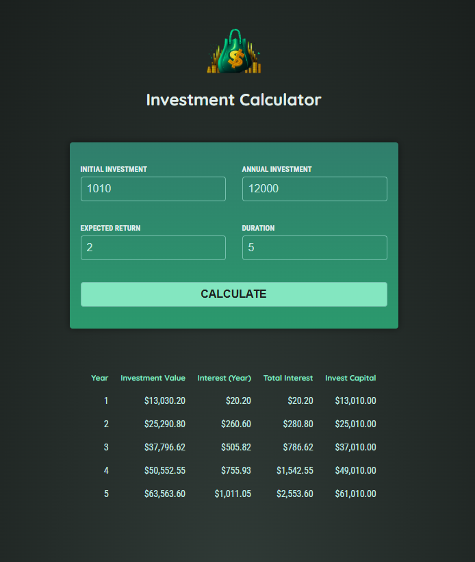

# Investment Calculator

A simple Angular app that projects the growth of an investment over time. Enter an initial investment, annual contribution, expected return rate, and duration, and the app calculates a year-by-year breakdown of interest earned, total interest, and total amount invested.

Built as an Angular learning project using standalone components and signals.

**Live demo:** https://kaylin98.github.io/Investment-Calculator/



## Features

- Input form for initial investment, annual investment, expected return (%), and duration (years)
- Year-by-year results table showing:
  - Interest earned that year
  - Total interest earned to date
  - Total amount invested
  - Investment value at year end
- Reactive state management via Angular signals (`InvestmentService`)

## Tech Stack

- [Angular](https://angular.io/) 18 (standalone components, signals)
- TypeScript
- Karma / Jasmine for unit tests

## Getting Started

### Prerequisites

- [Node.js](https://nodejs.org/) and npm
- [Angular CLI](https://angular.io/cli) (`npm install -g @angular/cli`)

### Install dependencies

```bash
npm install
```

### Development server

```bash
npm start
```

Navigate to `http://localhost:4200/`. The app will automatically reload if you change any of the source files.

### Build

```bash
npm run build
```

Build artifacts are stored in the `dist/` directory.

### Running unit tests

```bash
npm test
```

Runs unit tests via [Karma](https://karma-runner.github.io).

## Project Structure

```
src/app/
├── header/                  # App header component
├── user-input/              # Form for entering investment parameters
├── investment-results/      # Table displaying calculated results
├── investment.service.ts    # Calculation logic and shared state (signals)
└── investment-input.model.ts
```

## How It Works

1. `UserInputComponent` collects the initial investment, annual investment, expected return, and duration.
2. On submit, it calls `InvestmentService.CalculateInvestmentResults()`, which computes compounding growth year by year.
3. Results are stored in a signal and rendered by `InvestmentResultsComponent`.
